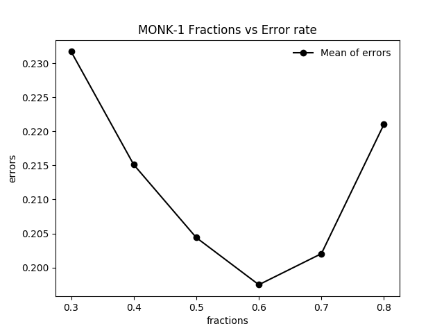
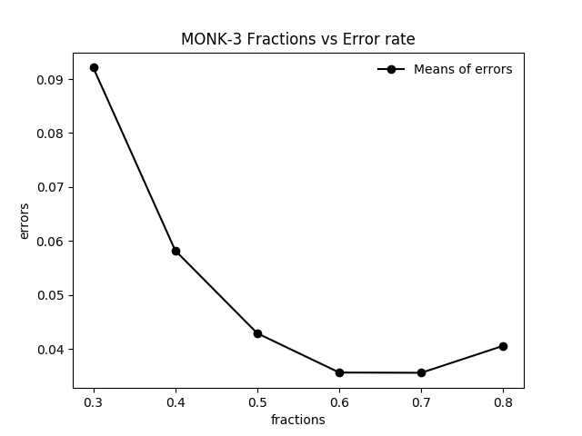

## Decision trees, Machine Learning DD2421 Lab 1

_authors: wvage@kth.se, oskarolo@kth.se_.

### Assignment 0
_**Assignment 0**: Each one of the datasets has properties which makes
them hard to learn. Motivate which of the three problems is most
difficult for a decision tree algorithm to learn_.

The MONK-2 dataset would be the hardest to learn because every variable is independent from each other.  
The MONK-1 dataset could also be hard to learn because it could take time to realise that a1 and a2 has to be equal.  
It would be easiest to learn the MONK-3 dataset because it would be easier to see that every time a5 and a4 is 1 or every time a5 is not 4 and a2 is not 3 it would evaluate to true. 

### Assignment 1
_**Assignment 1**: The file dtree.py defines a function entropy which
calculates the entropy of a dataset. Import this file along with the
monks datasets and use it to calculate the entropy of the training
datasets_.

Dataset                | Entropy
----------------------------|-----------------------------
MONK-1        | 1.0
MONK-2 | 0.957117428264771
MONK-3 | 0.9998061328047111

Code is in assingnment.py, the function calculate_entropy.  

### Assignment 2
_**Assignment 2**: Explain entropy for a uniform distribution and a
non-uniform distribution, present some example distributions with
high and low entropy_.

Example for a uniform distrubtion: Rolling a dice has entropy 2.58 which is higher than tossing a coin which has entropy 1. This is because when tossing a coin we have a larger possibility of producing an certain outcome, which leads to lower unpredictability/entropy.

Example for a non-uniform distribution: A non-uniform distribution would be a fake coin that had 0.7 probability of showing tails and a 0.3 probability of showing heads. If we calculate the entropy for that we get that  
Entropy = -0.3log2(0.3) -0.7log2(0.7) = 0.881291

### Assignment 3
_**Assignment 3**: Use the function averageGain (defined in dtree.py)
to calculate the expected information gain corresponding to each of
the six attributes. Note that the attributes are represented as in-
stances of the class Attribute (defined in monkdata.py) which you
can access via m.attributes[0], ..., m.attributes[5]. Based on
the results, which attribute should be used for splitting the examples
at the root node?_

Dataset                | a1| a2|a3|a4|a5|a6
----------------------------|--|--|--|--|--|-------------------
MONK-1        | 0.07527255560831925 | 0.005838429962909286 | 0.00470756661729721 | 0.02631169650768228 | **0.28703074971578435** |  0.0007578557158638421 |
MONK-2        | 0.0037561773775118823  | 0.0024584986660830532 | 0.0010561477158920196 |  0.015664247292643818| **0.01727717693791797** | 0.006247622236881467
MONK-3        | 0.007120868396071844  |  **0.29373617350838865** |  0.0008311140445336207| 0.002891817288654397 |  0.25591172461972755| 0.007077026074097326  

On MONK-1 a5 should be the root node because of the most information gain.  
On MONK-2 a5 should be the root node.   
On MONK-3 a2 should be the root node.  

### Assignment 4
_**Assignment 4**: For splitting we choose the attribute that maximizes
the information gain, Eq.3. Looking at Eq.3 how does the entropy of
the subsets, S k , look like when the information gain is maximized?
How can we motivate using the information gain as a heuristic for
picking an attribute for splitting? Think about reduction in entropy
after the split and what the entropy implies._

When information gain for the subsets Sk is maximized the entropy gets smaller, the more information received the easier to determine the outcome.

We select an attribute to split that are reducing the uncertainty in subsets the most. This means we can move towards creating subsets which have lower and lower entropy.

### Assignment 5

Dataset                | E-train | E-test
----------------------------|-----|------------------------
MONK-1        | 0.0 | 0.17129629629629628
MONK-2 | 0.0 | 0.30787037037037035
MONK-3 | 0.0 | 0.05555555555555558

Our assumptions were incorrect, the entropy suggested that the MONK-2 dataset were the most predictable but in fact MONK-2 got the highest error rate. This could be because of overfitting.
The reason we get no error rate testing against the training set is because we've built the decision tree using this dataset. It is classifying perfectly against the training data but could be overfitted.

### Assignment 6
Pruning increases bias and reduces variance. Classification trees often have a high variance and by pruning and removing overfitted nodes or leaves we can reduce variance.

### Assignment 7
 

We get the lowest mean errors with the fraction of 0.8, which is logical.  
The bigger training set in comparison to the validation set, the less error rate.

Dataset                | 0.3| 0.4|0.5|0.6 | 0.7 | 0.8
----------------------------|--|--|--|--|--|-------------------
MONK-1-MEAN        | 0.231712 | 0.215115 | 0.204398 | 0.197476 | 0.202037 | 0.221041
MONK-1-STD        | 0.037062 | 0.039380 | 0.037177 | 0.047668 | 0.043113 | 0.035499
MONK-3-MEAN       |  0.092129 | 0.058240 | 0.042916 | 0.035648 | 0.035601 |  0.040601
MONK-3-STD        | 0.060879  | 0.044309 | 0.036160 | 0.031636 | 0.026694 | 0.032443
